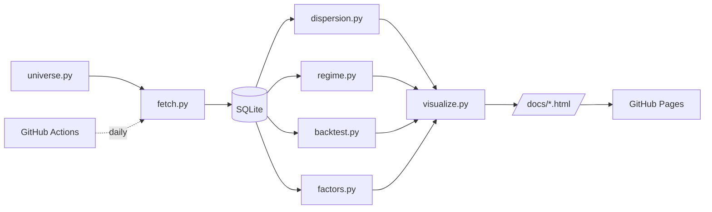

# AI Theme Dispersion Monitor

A daily monitor for **intra-AI-theme dispersion** with macro regime overlay,
a dispersion-conditional rotation backtest, and a five-factor exposure panel.
Built as an interpretable, PM-facing PoC.

> **Thesis.** As the AI trade matures, headline beta compresses while
> *within-theme* dispersion widens. Catching those windows is where active
> stock-selection alpha lives.

🔗 **Live dashboard:** https://chososo.github.io/ai-theme-dispersion-monitor/

---

## Pages

| Page | URL | What it shows |
|---|---|---|
| Overview | [`/index.html`](docs/index.html) | KPI cards · 3 dispersion metrics · macro regime ribbon |
| Backtest | [`/backtest.html`](docs/backtest.html) | Strategy NAV vs benchmark · drawdown · monthly heatmap |
| Signals | [`/signals.html`](docs/signals.html) | Factor exposure heatmap · per-ticker dispersion contribution |

All pages share a top nav and auto-refresh via GitHub Actions.

---

## Three lenses on dispersion

| Metric | Measures | Read |
|---|---|---|
| `avg_corr` (rolling avg pairwise correlation) | How much tickers move together | ↓ ⇒ more diversification benefit |
| `return_std` (cross-sectional std of daily returns) | Same-day differentiation | ↑ ⇒ more daily alpha potential |
| `top_bottom_spread` (best − worst daily return) | Magnitude of dispersion in P&L | ↑ ⇒ wider alpha capture |

Macro regime (rule-based: `risk_off` / `rate_shock` / `goldilocks` /
`neutral`) is rendered as shaded vertical bands on every chart.

---

## Strategy: dispersion-conditional rotation

| When | What |
|---|---|
| Dispersion **high** (avg_corr in bottom 30%ile of trailing 252d) | Top-N=3 by 21d momentum, equal-weight |
| Dispersion **low or middle** | Equal-weight full universe (capture beta) |

Rebalance month-end. Benchmark is equal-weighted buy-and-hold of the full
universe. Metrics reported: CAGR, Sharpe, MDD, hit rate.

---

## Five-factor exposure (cross-sectional z-scores)

| Factor | Proxy |
|---|---|
| `momentum` | 252d return − 21d return (12-1 momentum) |
| `lowvol`   | −1 × 60d daily return std |
| `quality`  | 252d return / 252d vol (info-ratio proxy) |
| `size`     | −1 × log(close)  *(price proxy until market cap is added)* |
| `reversal` | −1 × 21d return |

Z-scored within each date so rows are directly comparable across factors.

---

## Architecture



### Modules

```
src/
├── universe.py     # IP: which tickers belong to which sub-theme (US + KR)
├── fetch.py        # yfinance ingestion, incremental + failure-isolated
├── demo_data.py    # synthetic prices for offline testing
├── db.py           # SQLite: 6 tables, idempotent upserts, SQL-side JOIN/pivot
├── dispersion.py   # avg_corr / return_std / top_bottom_spread
├── regime.py       # rule-based macro classifier
├── backtest.py     # dispersion-conditional rotation + benchmark
├── factors.py      # 5-factor cross-sectional z-scores
└── visualize.py    # multi-page Plotly dashboard generator
```

### Design choices

- **SQLite + `INSERT OR REPLACE`** → daily re-runs are safe (idempotency).
  Raw `prices` is separated from derived metrics so logic can change
  without re-fetching.
- **Rule-based regime, not ML** → at PoC stage interpretability comes first;
  a PM has to be able to read the rule and immediately understand *why*
  today is `risk_off`. ML is the explicit V2 path.
- **Three metrics, not one** → correlation / volatility / spread are three
  angles on the same idea. Cross-validating reduces noise.
- **Cross-sectional z-score for factors** → every factor row has mean 0,
  std 1 so factor scores are directly comparable on a single heatmap.

---

## Universe

| Sub-theme | Tickers |
|---|---|
| `gpu_camp` | NVDA, AMD, AVGO |
| `tpu_camp` | GOOGL, TSM |
| `ai_infra` | MU, ASML, ARM, SMCI |
| `hyperscaler` | MSFT, META, AMZN |
| `kr_ai` | 005930.KS (Samsung), 000660.KS (SK Hynix), 042700.KS (Hanmi Semi), 058470.KQ (Leeno) |

---

## Quick start

```bash
pip install -r requirements.txt
cd src

# Option A — real data
python fetch.py

# Option B — synthetic data (no internet needed)
python demo_data.py

# Compute & render
python dispersion.py
python regime.py
python backtest.py
python factors.py
python visualize.py
```

Outputs land in `docs/{index,backtest,signals}.html`. Enable GitHub Pages
(Settings → Pages → Source: `main`, `/docs`).

---

## Automation

`.github/workflows/daily-update.yml` runs the full pipeline on a weekday
schedule (KST 07:30 = UTC 22:30 the day before) and on manual dispatch.
It commits refreshed pages back to `docs/`.

---

## Interview talking points

| Question | Answer |
|---|---|
| Why this topic? | Multiple 2026 sell-side outlooks flag widening intra-AI dispersion; for a PM it's where active selection alpha lives. |
| Why rule-based regime? | Interpretability first at PoC. A PM has to instantly know *why* today is `risk_off`. ML is V2 once labels accumulate. |
| Why three dispersion metrics? | Correlation / volatility / spread are three angles on the same idea; cross-validation cuts noise. |
| Where's the SQL skill? | 6-table normalized schema, idempotent `INSERT OR REPLACE`, SQL-side JOIN for the wide-format pivot. |
| How did you use Claude Code? | Pair-programmed: schema design, statistical sanity-check on dispersion, rule-based vs ML trade-off, multi-page refactor. |
| Limitations? | `size` is a price proxy (not real mkt cap); no transaction costs in backtest; ML regime not yet trained — all on the V2 backlog. |

---

## Roadmap (V3)

- Transaction cost & turnover model in the backtest
- Factor IC (information coefficient) time series
- GPR (Geopolitical Risk Index, Caldara & Iacoviello) external feed
- Random-forest regime classifier benchmarked against the rule
- Plotly Dash interactive filtering (sub-theme / date range)

---

## Built with Claude Code

Architecture and module design were drafted with Claude (web), and
implementation was paired with [Claude Code](https://claude.com/claude-code)
locally. See commit history for the step-by-step build.
